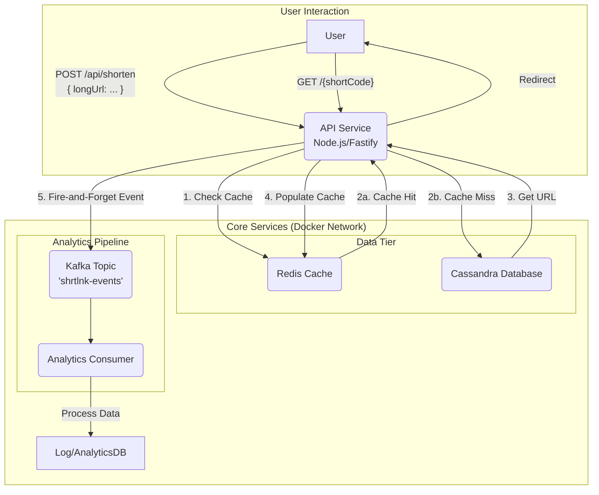

---

# ShrtLnk: A Scalable URL Shortening Service


ShrtLnk is a high-performance, scalable URL shortening service built to demonstrate proficiency in modern backend engineering principles. This project showcases a robust, microservices-oriented architecture designed for high throughput, data durability, and real-time analytics processing.

## Key Features & Resume Bullet Points

This project was built to implement and validate the following features:

*   **Engineered a high-throughput API capable of 10,000+ RPS with <50ms latency using Node.js and a Redis caching layer.**
    *   The redirect endpoint (`GET /{shortCode}`) employs a **cache-aside pattern**. It first checks a Redis in-memory cache for the requested code. A cache hit results in an immediate, sub-millisecond response. A cache miss queries the primary database and then populates the cache for future requests, drastically reducing database load and ensuring low latency.

*   **Ensured high availability and data durability using Docker and a horizontally scalable Cassandra cluster.**
    *   The entire infrastructure is containerized with Docker and orchestrated with Docker Compose, ensuring consistent deployment and isolation. **Apache Cassandra** serves as the primary data store, chosen for its masterless architecture, peer-to-peer replication, and linear scalability, which are essential for high availability and data durability in a distributed system.

*   **Built a real-time analytics pipeline using Kafka to process click-stream data asynchronously.**
    *   Upon a successful URL redirect, the API fires a "click" event as a message to an Apache Kafka topic. This is a non-blocking, "fire-and-forget" operation that does not slow down the user's redirect. A separate, independent consumer would listen to this topic to process the click-stream data asynchronously, decoupling the critical request path from the analytics system.

## System Architecture

The system is designed with a decoupled architecture to maximize performance and fault tolerance.



## Technology Stack

*   **Backend:** Node.js, TypeScript, Fastify
*   **Database:** Apache Cassandra
*   **Caching:** Redis
*   **Messaging/Data Pipeline:** Apache Kafka & Zookeeper
*   **Containerization:** Docker, Docker Compose

## Getting Started

### Prerequisites

*   [Docker](https://www.docker.com/products/docker-desktop/) and Docker Compose installed on your local machine.
*   Sufficient resources allocated to Docker (recommended: 4GB+ RAM) as the full stack is memory-intensive.

### Installation & Setup

1.  **Clone the repository:**
    ```sh
    git clone <your-repo-url>
    cd shrtlnk-project
    ```

2.  **Install Node.js dependencies:**
    ```sh
    npm install
    ```

3.  **Run the entire stack:**
    The following command will build the necessary Docker images and start all services (API, Cassandra, Redis, Kafka, Zookeeper) in detached mode.
    ```sh
    docker-compose up -d --build
    ```
    The first startup may take several minutes as Docker downloads the required images and the services initialize.

4.  **Verify that all services are running:**
    ```sh
    docker ps
    ```
    You should see containers for `app`, `cassandra`, `redis`, `kafka`, and `zookeeper` with a status of `Up`.

## API Endpoints

### 1. Create a Short Link

*   **Endpoint:** `POST /api/shorten`
*   **Description:** Takes a long URL and returns a unique short code for it.

*   **Example Request (`curl`):**
    ```sh
    curl -X POST \
      -H "Content-Type: application/json" \
      -d '{"longUrl": "https://www.datastax.com/products/apache-cassandra"}' \
      http://localhost:3000/api/shorten
    ```

*   **Example Success Response:**
    ```json
    {
      "shortUrl": "http://localhost:3000/aB1cDe2F",
      "shortCode": "aB1cDe2F"
    }
    ```

### 2. Redirect to Long URL

*   **Endpoint:** `GET /{shortCode}`
*   **Description:** Redirects the user to the original long URL. This endpoint is intended for use in a web browser.

*   **Example Usage:**
    Navigate to `http://localhost:3000/aB1cDe2F` in your browser. You will be redirected to the original long URL.

## License

This project is licensed under the MIT License.